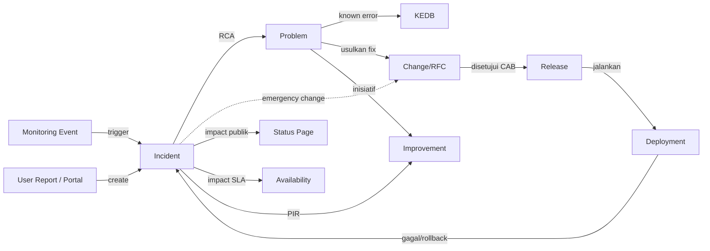
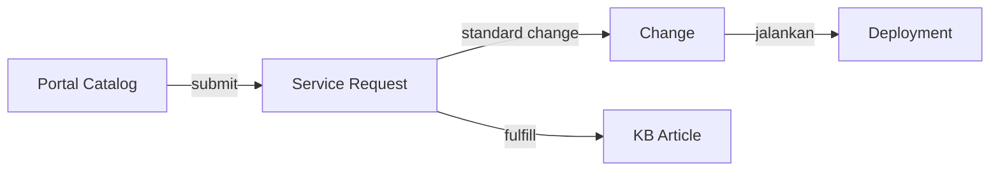
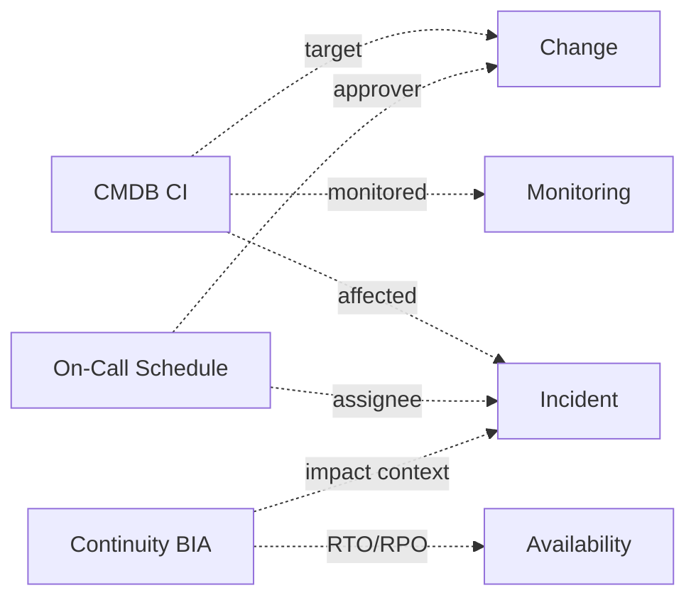

# OIS — Dokumentasi Halaman (Per-Page Reference)

Dokumen ini adalah peta lengkap setiap halaman pada sidebar **Management mode** OIS (Omni Intelligence Suite). Setiap halaman punya file sendiri dengan struktur seragam: fitur, anatomi UI, alur pengguna, model state, dependency, dan endpoint API.

> Untuk halaman **AI Workspace mode**, lihat dokumen terpisah di `docs/AI/` (belum dibuat).

---

## Cara Membaca Dokumen Ini

1. Mulai dari **diagram chain ITSM** di bawah untuk memahami bagaimana halaman saling terhubung.
2. Buka file halaman spesifik (mis. `incidents.md`) untuk detail fitur, UX flow, dan dependency.
3. Lihat **Dependency Matrix** di akhir untuk lookup cepat "halaman X baca/tulis ke halaman Y".

---

## Daftar Halaman

### Operations
| Halaman | Route | Ringkasan |
|---|---|---|
| [Overview / Dashboard](./overview.md) | `/` | Operational Pulse: KPI, insiden aktif, inbox, perubahan mendatang |
| [Inbox](./inbox.md) | `/inbox` | Antrian item personal yang butuh aksi user |
| [Incidents](./incidents.md) | `/incidents` | Manajemen insiden + War Room major + Analytics |
| [Problems](./problems.md) | `/problems` | Problem record, RCA workspace, KEDB |

### Service Delivery
| Halaman | Route | Ringkasan |
|---|---|---|
| [Self-Service Portal](./portal.md) | `/portal` | Portal end-user: katalog, my requests |
| [Service Requests](./requests.md) | `/requests` | Antrian fulfillment request |
| [Knowledge Base](./kb.md) | `/kb` | Browse, baca, edit, dan analitik artikel KB |

### Change & Delivery
| Halaman | Route | Ringkasan |
|---|---|---|
| [Changes](./changes.md) | `/changes` | RFC, kalender, CAB workspace |
| [Releases](./releases.md) | `/releases` | Release planning + pipeline + notes |
| [Deployments](./deployments.md) | `/deployments` | Antrian deployment + environments |
| [Testing](./testing.md) | `/testing/plans` | Test plans, cases, runs, sign-off |

### Service Health
| Halaman | Route | Ringkasan |
|---|---|---|
| [Availability](./availability.md) | `/availability` | Dashboard, SLA targets, outages |
| [Capacity](./capacity.md) | `/capacity` | Dashboard, forecast, threshold |
| [Continuity](./continuity.md) | `/continuity/bia` | BIA matrix, DR plans, DR tests |
| [Status Page](./status-page.md) | `/status` | Status publik service |

### Observability
| Halaman | Route | Ringkasan |
|---|---|---|
| [Monitoring](./monitoring.md) | `/monitoring` | Overview, event stream, rules, routing, coverage |
| [Measurement](./measurement.md) | `/dashboards` | Executive dashboards, reports, metric catalog |

### Foundation
| Halaman | Route | Ringkasan |
|---|---|---|
| [CMDB](./cmdb.md) | `/cmdb` | Configuration Items, graph view, audit trail |
| [On-Call](./on-call.md) | `/on-call` | Schedule, overrides, escalation |
| [Improvements](./improvements.md) | `/improvement` | Register, kanban, heatmap, benefit tracker |

### Platform
| Halaman | Route | Ringkasan |
|---|---|---|
| [RBAC Admin](./admin.md) | `/admin` | Divisions, departments, teams, users, roles, permissions |
| [Settings](./settings.md) | `/settings` | Pengaturan personal & tenant |
| [Profile](./profile.md) | `/profile` | Profil user (title, bio, timezone, dst) |
| [Notifications](./notifications.md) | `/notifications` | Notifikasi & preferensi delivery |

---

## Chain ITSM — Diagram Alur Lintas Halaman

### Chain utama: Event → Incident → Problem → Change → Release → Deployment

### Chain pendukung: Service Request → Standard Change

### Chain konteks: CMDB & On-Call menopang semua

---

## Dependency Matrix Singkat

Baris = halaman yang **membaca** data; Kolom = halaman yang **menyediakan** data.

| ↓ Reader / Provider → | CMDB | Monitoring | Incidents | Problems | Changes | Releases | KB | On-Call | BIA | Availability |
|---|---|---|---|---|---|---|---|---|---|---|
| **Overview**      | ✓ | ✓ | ✓ | ✓ | ✓ |   |   | ✓ |   | ✓ |
| **Inbox**         |   |   | ✓ | ✓ | ✓ |   |   |   |   |   |
| **Incidents**     | ✓ | ✓ | — | ✓ | ✓ |   | ✓ | ✓ | ✓ | ✓ |
| **Problems**      | ✓ |   | ✓ | — | ✓ |   | ✓ |   |   |   |
| **Changes**       | ✓ |   | ✓ | ✓ | — | ✓ |   | ✓ |   |   |
| **Releases**      |   |   |   |   | ✓ | — |   |   |   |   |
| **Deployments**   | ✓ |   | ✓ |   | ✓ | ✓ |   |   |   |   |
| **Availability**  | ✓ |   | ✓ |   |   |   |   |   | ✓ | — |
| **Status Page**   |   |   | ✓ |   |   |   |   |   |   | ✓ |
| **Improvements**  |   |   | ✓ | ✓ | ✓ |   |   |   |   |   |
| **Measurement**   | ✓ | ✓ | ✓ | ✓ | ✓ | ✓ | ✓ |   |   | ✓ |

✓ = membaca; — = halaman itu sendiri.

---

## Konvensi Penulisan

Setiap dokumen halaman mengikuti template:

1. **Overview** — tujuan, ITIL practice, route(s)
2. **Routes & Sub-pages** — list/detail/tab/modal
3. **Key Features** — daftar kapabilitas
4. **Page Anatomy** — section UI
5. **Detail Page Deep-Dive** — tabs, panel, aksi inline
6. **User / UX Flow** — happy path + alternate
7. **State Model** — status & transisi
8. **Roles & Permissions** — RBAC
9. **Upstream Dependencies** — data yang dibaca
10. **Downstream Effects** — data yang ditulis / event yang dipicu
11. **Data Model** — Prisma model & DTO
12. **API Endpoints** — endpoint yang dipanggil
13. **Realtime / Jobs** — Socket.io & scheduler
14. **Open Gaps / TODO** — stub & item M7

---

**Update terakhir:** 2026-05-16
